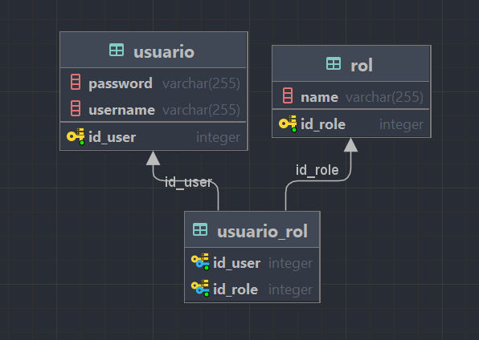

## BASE DE DATOS
### TABLAS
#### - Usuario: Colum id, username, password
####  - Rol: Colum id, rol
#### - Usuario_rol: Colum id_user, id_role (Claves primarias y foraneas para actuar como una tabla intermedia en una relación de Muchos a Muchos)
